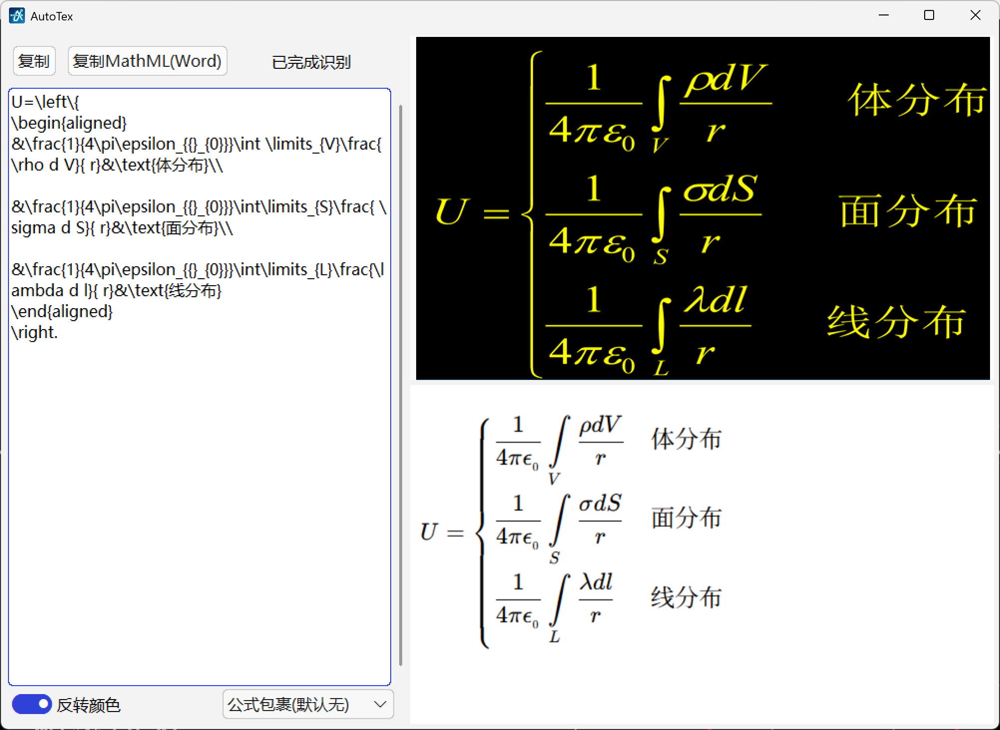
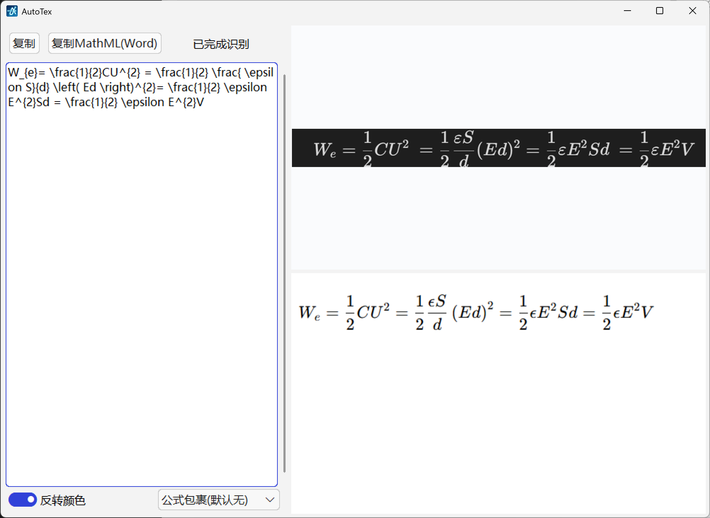

# AutoTex2

基于[OleehyO/TexTeller](https://github.com/OleehyO/TexTeller)的公式识别应用。

相比于[AutoTex](https://github.com/Smart-Space/AutoTex)使用的UniMERNet，TexTeller在印刷体、电子版公式，特别是复杂公式上表现得更好，并且直接支持含中文代码公式。



>[!WARNING]
>
>由于本项目使用tkwebview，只支持Windows平台。

## 特点
### 可支持独立gpu

如果使用了支持gpu的pytorch，就可以使用gpu。

### 图片展示与公式预览区域

AutoTex2的图片展示与公式预览区域在右侧水平等分排列，支持图片任一方向填充，生成结果若超出视图范围，可以滚动查看，可放大缩小，对长公式和大段公式友好。

### 图片底色识别

AutoTex2会判断**灰度颜色均值**区分暗色和亮色，并检查暗色像素和亮色像素的多少，少的色域为文本，以此自动判断是否需要反转图片颜色。AutoTex2仍然保留用户对于是否反转图片颜色的手动控制选项，不过一般情况下，“色域像素少的代表文本”是没有错的。



### 仅支持通过粘贴上传图片

AutoTex不提供图片文件上传和截图功能。选择图片文件上传动作太慢，拖动和复制粘贴在效率上没有本质区别，而且我自己是几乎不可能把公式图片单存为一个文件的，即便是手写稿，也是存一大段，干脆打开截图。然而，截图功能，就交给系统或者专业软件吧。

### 预览界面动态更新

每次识别到公式后，直接调用已有的js函数(`render`)更新公式区域，无需每次重新加载资源。该函数定义在`./libs/index.html`。

### 静默运行

只有在托盘图标菜单中点击“退出”才会真正退出AutoTex。

### 简单易懂的源码

UI框架使用tkinter(TinUI)，使用面板布局，结构非常清晰。

模型加载和识别使用线程，不影响软件使用（虽然这期间没什么可用的）。

使用事件和中间数据文件(`data.py`)管理流程。

## 运行

建议使用`python>=3.10`的虚拟环境干净搭建。

### 模型

TexTeller的模型在huggingface（https://huggingface.co/OleehyO/TexTeller）上，直接使用`texteller.api`时会自动下载。

不过，建议新建`model`文件夹，并将模型文件手动下载放到`./model`里。

**注意**，在`process.py`中，`model_dir`默认为`./model`。

### 依赖

安装AutoTex的依赖：

```bash
pip install texteller, tinui, pystray, tkwebview, latex2mathml
```

理论上，就可以运行了：

```bash
python main.py
```
